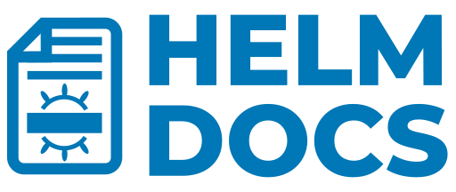

<h1 style="text-align:center;">helm-docs</h1>
<p style="text-align:center;">
  <i>'helm-docs' helps you document your helm charts services by automating markdown creation with chart metadata </i>
   <br/>
  
  <br/>
  <b><a href="./example-charts/README.md">Example Charts</a></b> | <b><a href="./docs/introduction/quick_start.md">Getting Started</a></b> | <b><a href="https://norwoodj.github.io/helm-docs/">Documentation</a></b> | <b><a href="https://github.com/norwoodj/helm-docs">GitHub</a></b>
  <br/><br/>
  <a href="./LICENSE">
    
  </a>
  
  <a href="https://goreportcard.com/report/github.com/norwoodj/helm-docs">
    
  </a>
  <a href="https://hub.docker.com/r/jnorwood/helm-docs">
    
  </a>
  <a href="https://github.com/norwoodj/helm-docs/actions/workflows/build.yml">
   
  </a>

</p>


The helm-docs tool auto-generates documentation from helm charts into markdown files. The resulting
files contain metadata about their respective chart and a table with each of the chart's values, their defaults, and an
optional description parsed from comments.

> Interested in contributing or just seeing helm-docs in action? Head over to [CONTRIBUTING.md](CONTRIBUTING.md) to learn how to spin up the project!

<details>
  <summary><b>Table of Contents</b></summary>
  <p>

- **Getting Started**
  - a
- **Feature Overview**
  - a

  </p>
</details>

## How Does it work?
The markdown generation is entirely [gotemplate](https://golang.org/pkg/text/template) driven. The tool parses metadata
from charts and generates a number of sub-templates that can be referenced in a template file (by default `README.md.gotmpl`).
If no template file is provided, the tool has a default internal template that will generate a reasonably formatted README.

The most useful aspect of this tool is the auto-detection of field descriptions from comments:
```yaml
config:
  databasesToCreate:
    # -- default database for storage of database metadata
    - postgres

    # -- database for the [hashbash](https://github.com/norwoodj/hashbash-backend-go) project
    - hashbash

  usersToCreate:
    # -- admin user
    - {name: root, admin: true}

    # -- user with access to the database with the same name
    - {name: hashbash, readwriteDatabases: [hashbash]}

statefulset:
  image:
    # -- Image to use for deploying, must support an entrypoint which creates users/databases from appropriate config files
    repository: jnorwood/postgresql
    tag: "11"

  # -- Additional volumes to be mounted into the database container
  extraVolumes:
    - name: data
      emptyDir: {}
```

Resulting in a resulting README section like so:

| Key | Type | Default | Description |
|-----|------|---------|-------------|
| config.databasesToCreate[0] | string | `"postgresql"` | default database for storage of database metadata |
| config.databasesToCreate[1] | string | `"hashbash"` | database for the [hashbash](https://github.com/norwoodj/hashbash-backend-go) project |
| config.usersToCreate[0] | object | `{"admin":true,"name":"root"}` | admin user |
| config.usersToCreate[1] | object | `{"name":"hashbash","readwriteDatabases":["hashbash"]}` | user with access to the database with the same name |
| statefulset.extraVolumes | list | `[{"emptyDir":{},"name":"data"}]` | Additional volumes to be mounted into the database container |
| statefulset.image.repository | string | `"jnorwood/postgresql:11"` | Image to use for deploying, must support an entrypoint which creates users/databases from appropriate config files |
| statefulset.image.tag | string | `"18.0831"` |  |

You'll notice that some complex fields (lists and objects) are documented while others aren't, and that some simple fields
like `statefulset.image.tag` are documented even without a description comment. The rules for what is and isn't documented in
the final table will be described in detail later in this document.

## Installation
helm-docs can be installed using [homebrew](https://brew.sh/):

```bash
brew install norwoodj/tap/helm-docs
```

or [scoop](https://scoop.sh):

```bash
scoop install helm-docs
```

This will download and install the [latest release](https://github.com/norwoodj/helm-docs/releases/latest)
of the tool.
